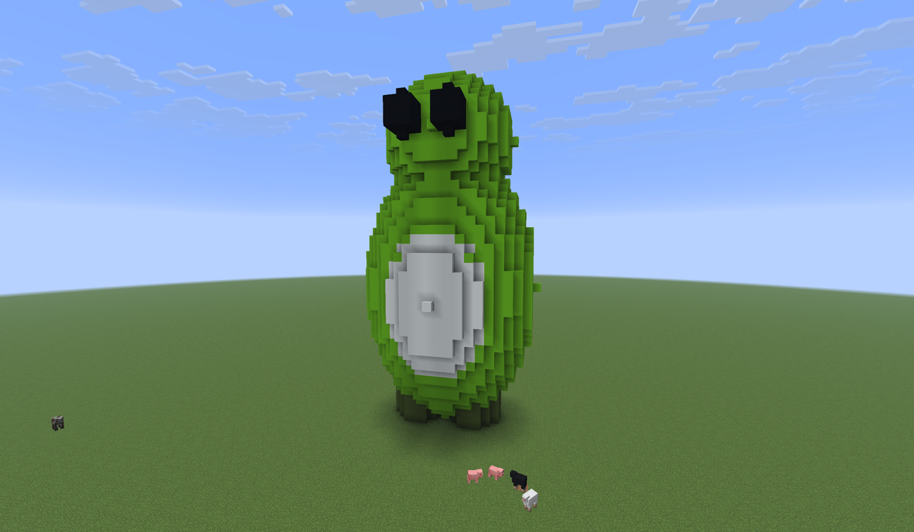
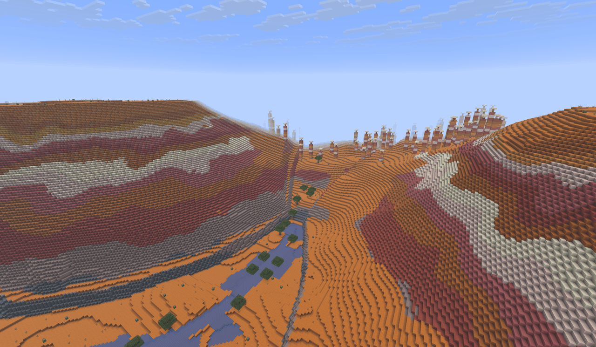

<p align="center">
  
</p>

# Minecraft Java MCP Server (Fabric)

<p align="center">
  <a href="https://modrinth.com/mod/fabric-api-mcp-server"></a>
  <a href="https://www.curseforge.com/minecraft/mc-mods/fabric-api-mcp-server"></a>
</p>

> **Install the mod from [Modrinth](https://modrinth.com/mod/fabric-api-mcp-server) or
> [CurseForge](https://www.curseforge.com/minecraft/mc-mods/fabric-api-mcp-server).** Pick the jar
> that matches your Minecraft version, drop it in `mods/` alongside Fabric API, and launch. Full
> walkthrough in [Quick start](#quick-start-single-player-default-config) below.

A [Model Context Protocol](https://modelcontextprotocol.io) (MCP) server that runs **inside Minecraft
Java Edition as a Fabric mod**. It exposes the server-side Minecraft API and the Fabric API as MCP
tools so an MCP client — Claude Desktop, Cursor, or any agent that speaks MCP — can read and
manipulate a live world programmatically.



*An agent built this over MCP — authored as a parametric voxel model, then placed
in a single `block_fill_batch` and verified with `block_render_region` (the
server-side render that produced no screenshot dependency — it reads block map
colours straight from the world).*


*And **Ghasticlawd** — the project's Ghast × Claude mascot — voxelized, placed via
`block_fill_batch`, and confirmed with `block_render_region`.*



*And terrain, too — this red-rock canyon, inspired by the national parks of the
American West, was generated as a hydraulically eroded heightfield,
render-checked, then materialized into the world through `block_fill_batch` and
verified with `block_render_region`.*

The mod ships separate jars for each supported Minecraft version. The build matrix in v0.2.0 is
**1.21.11**, **26.1.1**, and **26.1.2**.

### Two endpoints: world + inspection

The same jar exposes two MCP servers. The **`main`** entrypoint serves the world tools on
`minecraft-java` (default port 8765) wherever a server runs — dedicated or single-player. The
**`client`** entrypoint runs inside a real, rendered client and serves an inspection-only surface
on `minecraft-java-client` (default port 8766): `view_capture` returns the player's actual
first-person frame as a PNG, and `sense_*` / `client_status` read client-side perception. It is the
way an agent SEES the world as a player does — the real rendered pixels the headless server can't
produce. Run server-only, client-only (single-player gives you both endpoints from one process), or
a server+client combo. See
[docs/configuration.md](docs/configuration.md#two-mcp-servers-world--inspection).

## ⚠️ Built on Minecraft and Fabric API internals

This mod depends on Minecraft's server-side internals via the Fabric API. The API surface evolves
between Minecraft versions and a Minecraft update can change, deprecate, or remove methods this
mod relies on. Pin your Minecraft installation, your Fabric API jar, and this mod's jar to known-good
versions and upgrade them together. Treat the stack as **experimental**.

## The sibling projects

This server pairs with a companion Claude Code plugin, and the whole thing is the Java Edition
counterpart of an existing Bedrock stack:

| Repository | Edition | Role |
| --- | --- | --- |
| **`minecraft-java-fabric-mcp-server`** (this repo) | Java Edition | The MCP server, packaged as a Fabric mod. Loads inside Minecraft and exposes the Java API as MCP tools. |
| [`minecraft-java-fabric-claude-plugin`](https://github.com/chapmanjw/minecraft-java-fabric-claude-plugin) | Java Edition | The companion Claude Code plugin. Bundles the MCP connection plus setup and builder skills/agents that drive this server. |
| [`minecraft-bedrock-mcp-server`](https://github.com/chapmanjw/minecraft-bedrock-mcp-server) | Bedrock Edition | The Node/TypeScript MCP server for the Bedrock Dedicated Server. |
| [`minecraft-bedrock-mcp-behavior-pack`](https://github.com/chapmanjw/minecraft-bedrock-mcp-behavior-pack) | Bedrock Edition | The companion behavior pack for the Bedrock setup. |

The plugin is optional — any MCP client (Claude Desktop, Cursor, a hand-configured `claude mcp add`)
can talk to this server directly — but on Claude Code it's the fastest path: it wires up the
connection and ships the building skills and agents. See
[Connect an MCP client](#7-connect-an-mcp-client) below.

The Java and Bedrock stacks are independent — installing one has no effect on the other. They share
a tone and configuration style but expose different (overlapping) tool surfaces because the Java and
Bedrock Script APIs differ substantially.

## How it works

```
MCP client (Claude Desktop, Cursor, …)
   │   MCP over Streamable HTTP, localhost-only by default
   ▼
[ Fabric mod: HTTP transport ]   ←—— Host / Origin / optional bearer validation
   │
   ▼
[ Protocol layer ] ←—— JSON-RPC 2.0 over Streamable HTTP, tool registry
   │
   ▼
[ Runtime: MinecraftMainThreadExecutor ]   ←—— marshals every world touch onto the server main thread
   │
   ▼
[ Adapter layer ]   ←—— version-stable interface; per-version implementations
   │
   ▼
the loaded Minecraft world (integrated single-player, or dedicated server)
```

Every tool call:

1. Arrives on an HTTP thread of the embedded JDK `HttpServer`.
2. Passes Host / Origin / (optional) bearer / body-size / rate-limit checks.
3. Is dispatched by the MCP layer to a tool implementation.
4. The tool submits any Minecraft API access through the main-thread executor.
5. The executor completes the work on the next server tick and returns the result.
6. The HTTP thread serializes the result to JSON and responds.

See [docs/architecture.md](docs/architecture.md) for the detailed layering rationale.

## Quick start (single-player, default config)

End-to-end: a clean machine to "Claude making it rain chicken jockeys in your village." The default
configuration binds to `127.0.0.1:8765`, **no token required**, with strict Host/Origin validation
that defends against DNS-rebinding and CSRF.

### 1. Install Java

The mod runs inside the Minecraft launcher's JVM, which the launcher itself manages — for typical
single-player play you don't need to install Java separately. (You only need a system JDK if you're
[building from source](#building-from-source).)

### 2. Install Minecraft Java Edition and the launcher

If you don't already have it, get the Minecraft Launcher from
[minecraft.net/download](https://www.minecraft.net/download). Launch it once, sign in, and load a
vanilla world to confirm the install works.

### 3. Install Fabric Loader

Download the [Fabric Loader installer](https://fabricmc.net/use/installer/) and run it. Pick the
Minecraft version you want (one of **1.21.11**, **26.1.1**, or **26.1.2** — the versions this mod
ships jars for) and click Install. The installer registers a new "fabric-loader-…" profile in the
Minecraft Launcher and creates a `mods/` folder under your game directory.

### 4. Download the mod and Fabric API

- This mod — get it from your preferred mod host and pick the jar whose suffix matches your
  Minecraft version (e.g. `minecraft-fabric-mcp-0.2.0+1.21.11.jar`):
  - **[Modrinth](https://modrinth.com/mod/fabric-api-mcp-server)** (recommended)
  - **[CurseForge](https://www.curseforge.com/minecraft/mc-mods/fabric-api-mcp-server)**
  - or the [GitHub Releases page](https://github.com/chapmanjw/minecraft-java-fabric-mcp-server/releases).
- [Fabric API](https://modrinth.com/mod/fabric-api): pick the version that matches the same MC
  version.

### 5. Install both jars

Drop both jars into your Minecraft `mods/` directory:

- **Windows**: `%APPDATA%\.minecraft\mods\`
- **macOS**: `~/Library/Application Support/minecraft/mods/`
- **Linux**: `~/.minecraft/mods/`

### 6. Launch the Fabric profile

Open the Minecraft Launcher, select the **fabric-loader-…** profile from the dropdown, click Play,
and open any world (existing or new). When the world finishes loading, the integrated server starts
and the MCP listener binds to `http://127.0.0.1:8765/mcp`. Confirm with:

```sh
curl http://127.0.0.1:8765/healthz
# → {"status":"ok"}
```

### 7. Connect an MCP client

The mod speaks MCP over **Streamable HTTP**. Connect from whichever client you use.

**Claude Code (CLI) — via the plugin (recommended):** the companion
[`minecraft-java-fabric-claude-plugin`](https://github.com/chapmanjw/minecraft-java-fabric-claude-plugin)
wires up the MCP connection *and* installs the setup and building skills/agents. From a Claude Code
session, run:

```
/plugin marketplace add chapmanjw/minecraft-java-fabric-claude-plugin
/plugin install minecraft-java@minecraft-java-claude
```

Restart Claude Code afterward. See the plugin's README for what each skill and agent does.

**Claude Code (CLI) — manual:** if you'd rather connect the raw tools without the plugin, run once
from a terminal —

```sh
claude mcp add --transport http minecraft-java http://localhost:8765/mcp
```

**Claude Desktop:** edit the desktop app's `claude_desktop_config.json` (Settings → Developer → Edit
Config) and add:

```json
{
  "mcpServers": {
    "minecraft-java": {
      "command": "npx",
      "args": ["-y", "mcp-remote", "http://localhost:8765/mcp"]
    }
  }
}
```

Then restart Claude Desktop. For authenticated / remote setups, see
[docs/claude-desktop-integration.md](docs/claude-desktop-integration.md) and
[docs/cursor-integration.md](docs/cursor-integration.md).

### 8. Try it

In any Claude session with the MCP server connected, ask it natural-language things like:

- _"Who's online in Minecraft right now?"_ → `player_list_online`
- _"Give me 64 diamonds."_ → `player_give_item`
- _"Set it to noon and clear the weather."_ → `level_set_time`, `level_set_weather`
- _"Build me a 5×5×5 box of glass at my feet."_ → `block_fill_region`
- _"Find a nearby village."_ → `entity_query` for `minecraft:villager`
- _"Make it rain chicken jockeys over the village."_ → 20× `command_execute` with
  `summon minecraft:chicken <x> <y> <z> {Passengers:[{id:"minecraft:zombie",IsBaby:1b}]}` plus
  `level_set_weather` set to `thunder` for atmosphere.

That last one is the canonical smoke test. If chickens with baby zombie riders rain down from the
sky over your village while a thunderstorm rolls in, the whole stack is wired up correctly.

The full single-player walkthrough (with dedicated-server and LAN variants) lives in
[docs/setup-singleplayer.md](docs/setup-singleplayer.md). For a dedicated server with bearer auth
and remote access, see [docs/setup-dedicated-server.md](docs/setup-dedicated-server.md).

## Configuration

All configuration is JSON-on-disk at `<game dir>/config/minecraft_fabric_mcp/config.json`, with every field
overridable by an environment variable (`MCP_<UPPER_SNAKE_FIELD>`). Defaults are baked into the mod —
the file only needs to exist if you're overriding something.

| Field | Default | Description |
| --- | --- | --- |
| `host` | `127.0.0.1` | Bind address. Non-loopback requires `auth_required=true` and `allow_remote=true`. |
| `port` | `8765` | Listen port. |
| `auth_required` | `false` | When true, every request must carry `Authorization: Bearer <bearer_token>`. |
| `bearer_token` | _(null)_ | When `auth_required=true` and this is null, the mod generates a 32-byte hex token and writes it back into the config file. |
| `allow_remote` | `false` | Required true when `host` is non-loopback. Belt-and-suspenders so you don't accidentally expose the listener. |
| `allowed_origins` | `[]` | Browser-style `Origin` allow-list. Default rejects any request carrying an `Origin` header. |
| `command_timeout_ms` | `15000` | Per-tool wait for main-thread work. |
| `rate_limit_rpm` | `60` | Per-client requests per minute. |
| `max_body_bytes` | `16777216` | Max request body. |
| `event_buffer_size` | `1024` | Default per-subscription ring buffer size for `events_*` tools. |
| `queue_max` | `256` | Max concurrent async jobs (huge bulk operations). |
| `log_level` | `info` | SLF4J log level. |
| `tls_cert_path` / `tls_key_path` | _(null)_ | If both set, the listener serves HTTPS. Both must be set, or both null. |
| `metrics_enabled` | `false` | Reserved for the Prometheus `/metrics` endpoint (v0.2.0). |
| `included_categories` | `[]` | Allow-list of domain categories. If non-empty it replaces the default-ON set. One of `blocks`, `structures`, `world`, `entities`, `players`, `items`, `gameplay`, `scripting`, `registries`, `server`. |
| `excluded_categories` | `[]` | Domain categories to drop. Applied after the allow-list (or the default-ON set). |
| `max_access` | `write` | Access cap: `read`, `write`, or `admin`. Tools above the cap are dropped. The default `write` keeps admin/destructive tools off until you opt in. |
| `exclude_write_tools` | `false` | Legacy switch, equivalent to `max_access: read`. When true, only read tools register. |

See [Tool categories, access levels & defaults](#tool-categories-access-levels--defaults) for the full model and worked examples.

See [docs/configuration.md](docs/configuration.md) for the full reference and recipe-style examples.

## Security model summary

- The default bind is `127.0.0.1` with no token. Anything on the same machine can talk to the MCP
  endpoint; nothing else can.
- The `Host` header is validated against the bind address — DNS rebinding attacks that resolve an
  attacker-controlled domain to 127.0.0.1 still get rejected because their `Host` header is wrong.
- The `Origin` header is validated against `allowed_origins` (empty by default). Browsers always
  send `Origin` on cross-origin requests; legitimate MCP clients (`mcp-remote`, Cursor) do not.
- Binding non-loopback requires both `allow_remote: true` and `auth_required: true`. On first run
  with auth enabled, the mod generates a 32-byte hex bearer token, writes it back to the config
  file (with POSIX 600 permissions where supported), and logs it once.

Full threat model in [docs/security.md](docs/security.md).

## Tool surface

The mod registers tools whose names follow the **Minecraft Java API class** convention rather than
the Bedrock `mc_<domain>_<action>` style. Tools group by the class or concept they operate on:

| Domain | Examples |
| --- | --- |
| `server_*` | `server_get_status`, `server_set_motd`, `server_save_all_worlds` |
| `level_*` | `level_set_time`, `level_set_weather`, `level_create_explosion`, `level_get_biome_at` |
| `block_*` | `block_get_state`, `block_fill_region`, `block_fill_batch`, `block_scan_summary`, `block_render_region` |
| `block_entity_*` | `block_entity_get_nbt`, `block_entity_set_nbt` |
| `entity_*` | `entity_summon`, `entity_teleport`, `entity_apply_effect` |
| `player_*` | `player_list_online`, `player_give_item`, `player_send_title` |
| `inventory_*` | `inventory_get`, `inventory_set_slot`, `inventory_count_items` |
| `itemstack_*` | `itemstack_describe`, `itemstack_drop_at` |
| `command_*` | `command_execute`, `command_execute_as` |
| `scoreboard_*` | `scoreboard_add_objective`, `scoreboard_set_score`, `scoreboard_add_team` |
| `data_*` | `data_storage_get`, `data_attachment_set` |
| `structure_*` | `structure_save_from_world`, `structure_load_to_world` |
| `datapack_*` | `datapack_enable`, `datapack_disable` |
| `loot_table_*` / `recipe_*` / `tag_*` / `resource_loader_*` | registry-style read tools |
| `events_*` | `events_subscribe`, `events_poll`, `events_unsubscribe` |

A full reference with JSON Schemas and per-version annotations lives in [docs/tools.md](docs/tools.md).

## Tool categories, access levels & defaults

The 183 tools are filtered along two independent axes so you can narrow the surface by
**subsystem** and by **risk** at the same time:

- **Domain** — which part of Minecraft the tool touches: blocks, entities, the server itself,
  and so on. Ten categories, each tied to a tool-name prefix. This is the "I only care about
  world-building, hide the scoreboard plumbing" axis.
- **Access** — how dangerous the tool is: `read` (inspects state, mutates nothing) <
  `write` (the normal case: changes a block, an entity, an item) <
  `admin` (world-wide, server-lifecycle, or destructive — explosions, world-border resizing,
  difficulty and game-rule changes, datapack toggles, kicking players, registering commands).
  This is the "let the agent build, but don't let it reshape the world border or reload
  resources" axis.

An operator filters on both: pick the subsystems you want, then cap the blast radius.

### The ten domain categories

| Category | Domains / prefixes | Purpose | Default | ~Tools |
| --- | --- | --- | --- | --- |
| `blocks` | `block_*`, `block_entity_*` | Read, place, fill, clone, scan, render, and erode blocks and block-entity NBT | ON | 20 |
| `structures` | `structure_*` | Save / load / list named structure templates and their files | ON | 9 |
| `world` | `level_*`, `worldborder_*` | Time, weather, biomes, dimensions, spawn, features, particles, explosions, the world border | ON | 31 |
| `entities` | `entity_*` | Summon, query, teleport, tag, damage, effect, and edit-NBT for non-player entities | ON | 17 |
| `players` | `player_*`, `player_screen_*` | Inspect and act on connected players: inventory, XP, gamemode, messages, kick | opt-in | 16 |
| `items` | `inventory_*`, `itemstack_*`, `item_modify_*` | Inventory slots, item-stack inspection, container item edits | ON | 9 |
| `gameplay` | `scoreboard_*`, `bossbar_*`, `advancement_*` | Scoreboards, teams, boss bars, advancements — the game-state logic layer | opt-in | 30 |
| `scripting` | `command_*`, `function_*`, `schedule_*`, `events_*`, `data_storage_*`, `data_attachment_*` | Commands, datapack functions, scheduled work, event subscriptions, custom data | ON | 21 |
| `registries` | `recipe_*`, `loot_table_*`, `tag_*`, `content_registry_*`, `resource_loader_*`, `resource_condition_*`, `fluid_storage_*` | Recipe / loot / tag / resource lookups and content-registry edits | opt-in | 21 |
| `server` | `server_*`, `datapack_*` | Server status, MOTD, world saves, resource reloads, datapack enable/disable | ON | 9 |

Counts are the live 26.1.2 surface; earlier Minecraft targets register fewer (a tool gated on a
Fabric module or MC version drops out before categorization). Run `tools/list` against your build
for the exact set.

### What you get with no config

An empty config (or no config file at all) registers the **lean default set: about 102 of the 183
tools.** The rule is simple:

- **Default-ON domains:** `blocks`, `structures`, `world`, `entities`, `items`, `scripting`,
  `server`. The builder-and-operator core.
- **Opt-in domains:** `players`, `gameplay`, `registries`. Useful, but noise for most world-building
  sessions — turn them on when you need them.
- **Default access cap:** `max_access = write`. Read and write tools register; **admin tools do
  not.**

So the default surface is every read/write tool in the seven ON domains. The other 81 stay off until
you ask for them: 67 in the three opt-in domains (`players` 16 + `gameplay` 30 + `registries` 21)
and 14 admin tools that sit in ON domains but are suppressed by the `write` cap.

The 15 admin-tagged tools (all opt-in via `max_access: admin`):

```
worldborder_set_size        worldborder_add_size         worldborder_set_center
worldborder_set_warning_blocks  worldborder_set_warning_time
worldborder_set_damage_amount   worldborder_set_damage_buffer
level_set_difficulty        level_set_game_rule          level_create_explosion
command_register            server_reload_resources
datapack_enable             datapack_disable             player_kick
```

Fourteen of those sit in default-ON domains (only `player_kick` is in the opt-in `players` domain),
so on a default config they are present-but-suppressed by the `write` cap. Raise the cap to `admin`
and they appear.

### How the filter resolves

For each supported tool, in order:

1. **Domain allow-list.** If `included_categories` is non-empty, keep the tool only if its category
   is listed. Otherwise keep it only if its category is default-ON.
2. **Domain exclude.** Drop the tool if its category is in `excluded_categories`.
3. **Access cap.** Drop the tool if its access rank exceeds `max_access` (`read` < `write` <
   `admin`). `exclude_write_tools: true` is the legacy spelling of `max_access: read`.

`included_categories` is an outright replacement for the default-ON set — list it and the ON/opt-in
distinction no longer applies; you get exactly the categories you named (still subject to the
exclude list and the access cap).

### Config recipes

**(a) World-builder — the default.** No config needed. You get the ~102-tool core: build blocks and
structures, shape the world, summon and edit entities, move items, run commands and functions, save
the server. No admin reshaping, no scoreboard/registry clutter.

```json
{}
```

**(b) Read-only monitor.** Inspection only — nothing mutates. Good for an observer agent or a
dashboard.

```json
{
  "max_access": "read"
}
```

(`{"exclude_write_tools": true}` does the same thing.)

**(c) Datapack developer.** The default core plus the gameplay and registry surfaces for
advancements, loot, recipes, and tags. Still capped at `write`.

```json
{
  "included_categories": [
    "blocks", "structures", "world", "entities", "items",
    "scripting", "server", "gameplay", "registries"
  ]
}
```

There is no "default-ON plus these two" shorthand — the allow-list is all-or-nothing, so when you
need an opt-in domain, name the whole set you want (the seven ON domains plus your additions), as
above.

**(d) Full operator.** Every category, every access level — the entire 183-tool surface, including
admin/destructive tools.

```json
{
  "included_categories": [
    "blocks", "structures", "world", "entities", "players", "items",
    "gameplay", "scripting", "registries", "server"
  ],
  "max_access": "admin"
}
```

This is also how you **restore the old behavior.** Before this change an empty config registered all
183 tools; now an empty config gives the lean ~102. The snippet above brings the full surface back.

### The `command_execute` caveat

`command_execute` (and `command_execute_as`) are tagged **write**, not admin, because they are the
workhorse of almost every session. But a command can do anything the server console can —
`/difficulty`, `/worldborder`, `/gamerule`, `/datapack`, `/stop`. The access cap classifies the MCP
tool, not the command string it carries, so `max_access: write` is **not** an airtight sandbox: an
agent with `command_execute` can reach admin-level effects by typing the command directly.

For a genuinely hardened deployment, drop the command surface entirely — exclude `scripting`, or use
an allow-list that omits it:

```json
{
  "included_categories": ["blocks", "structures", "world", "entities", "items", "server"],
  "max_access": "write"
}
```

The category and access filters limit what an agent can *easily* do and shrink the tool list it
reasons over; they are not a substitute for the network-level controls (loopback bind, bearer auth,
Host/Origin validation) described in [docs/security.md](docs/security.md).

## Version compatibility

The mod ships **one jar per Minecraft version**. The v0.2.0 build matrix:

| Minecraft | Required JDK | Mappings        | Mod jar suffix |
| --------- | ------------ | --------------- | -------------- |
| 1.21.11   | 21           | Mojang official | `+1.21.11`     |
| 26.1.1    | 25           | unobfuscated    | `+26.1.1`      |
| 26.1.2    | 25           | unobfuscated    | `+26.1.2`      |

`./gradlew chiseledBuild` produces all three jars in one invocation. Each Stonecutter version
subproject has its own `versions/<ver>/build.gradle.kts` because the Fabric Loom plugin ID
differs across Minecraft versions (legacy `fabric-loom` for 1.21.x; `net.fabricmc.fabric-loom`
LoomNoRemap variant for 26.1+).

Each tool declares the Minecraft and Fabric API constraints it needs via the `@McpTool`
annotation, and the registration layer filters tools at startup. A tool that requires
`fabric-biome-api-v1` only registers when that module is loaded; a tool restricted to MC 26.1+
won't appear in the tool list on 1.21.11. Run `tools/list` against your specific build to see what's
available.

Full detail in [docs/version-compatibility.md](docs/version-compatibility.md).

## Claude Desktop integration

The mod speaks MCP over **Streamable HTTP**. Claude Desktop connects via the
[`mcp-remote`](https://www.npmjs.com/package/mcp-remote) adapter, which bridges a stdio entry to
the remote HTTP endpoint.

```json
{
  "mcpServers": {
    "minecraft-java": {
      "command": "npx",
      "args": ["-y", "mcp-remote", "http://localhost:8765/mcp"]
    }
  }
}
```

That's the default-config form (localhost, no token). For the authenticated form and the path to
Claude Desktop's config file on macOS / Windows, see
[docs/claude-desktop-integration.md](docs/claude-desktop-integration.md). For Cursor,
see [docs/cursor-integration.md](docs/cursor-integration.md).

## Endpoints

| Route | Method(s) | Purpose |
| --- | --- | --- |
| `/mcp` | `POST` | Single JSON-RPC request → JSON-RPC response |
| `/mcp` | `GET` | Server-to-client SSE stream (no spontaneous messages in v0.2.0) |
| `/mcp` | `DELETE` | Close session (no-op in the stateless v0.2.0 dispatcher) |
| `/mcp` | `OPTIONS` | CORS preflight |
| `/healthz` | `GET` | Liveness probe (no auth) |

## Building from source

```sh
# Build every version in the matrix (produces 3 jars)
./gradlew chiseledBuild

# Build a single version
./gradlew :1.21.11:build
./gradlew :26.1.2:build

# Switch the Stonecutter active subproject (used as the default for plain `./gradlew build`)
./gradlew "Reset active project" -Pversion=1.21.11
./gradlew build
```

Output jars land in `versions/<mcver>/build/libs/minecraft-fabric-mcp-<modver>+<mcver>.jar`.

**Requirements**: Gradle 9.4.0+ (the wrapper bundles it). The build needs both **JDK 21**
(toolchain target for 1.21.x) and **JDK 25** (toolchain target for 26.1.x; the Gradle daemon
must also run on JDK 25 because Loom enforces it at configure time). Set them via standard
env vars: `JDK_21` and `JDK_25`, or `JAVA_HOME_21_X64` and `JAVA_HOME_25_X64`. Gradle's
toolchain locator picks each one up automatically on CI (`actions/setup-java` exposes them)
and on developer machines (Corretto's Windows installer installs both into
`C:\Program Files\Amazon Corretto\`).

## Stability and versioning

This mod is a stable foundation for separately built MCP clients and agents. Its **public
contract**, governed by semantic versioning, is:

- tool **names**,
- tool **input schemas**,
- tool **output** (the `result` field of the response envelope),
- the MCP wire protocol revision (`2025-06-18` in v0.2.0),
- the configuration schema and environment variable names.

Internal layering (transport, runtime, adapter implementations) is not part of the contract and
may change at any time.

The **underlying Minecraft + Fabric API surface is not part of our contract** — a Minecraft update
can still break behavior even when our public contract is unchanged. Pin versions; upgrade them in
lock-step.

## Development

```sh
./gradlew spotlessApply       # auto-format
./gradlew check               # spotless, checkstyle, tests
./gradlew chiseledTest        # unit tests across every version
./gradlew "Reset active project" -Pversion=26.1.2
./gradlew runServer           # launches the Fabric dev server with the mod loaded
```

See [CONTRIBUTING.md](CONTRIBUTING.md) for the development workflow, code-style notes, and PR
checklist.

## Security disclosures

See [SECURITY.md](SECURITY.md). Use GitHub Security Advisories — don't open a public issue.

## License

MIT — see [LICENSE](LICENSE).

## Star History

<a href="https://www.star-history.com/?repos=chapmanjw%2Fminecraft-java-fabric-mcp-server&type=date&legend=top-left">
 <picture>
   <source media="(prefers-color-scheme: dark)" srcset="https://api.star-history.com/chart?repos=chapmanjw/minecraft-java-fabric-mcp-server&type=date&theme=dark&legend=top-left" />
   <source media="(prefers-color-scheme: light)" srcset="https://api.star-history.com/chart?repos=chapmanjw/minecraft-java-fabric-mcp-server&type=date&legend=top-left" />
   
 </picture>
</a>